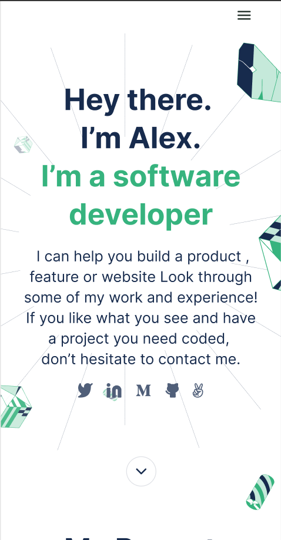

<!-- TABLE OF CONTENTS -->

# 📗 Table of Contents

- [📖 About the Project](#about-project)
  - [🛠 Built With](#built-with)
    - [Tech Stack](#tech-stack)
    - [Key Features](#key-features)
    - [Key Features](#key-features)
  - [🚀 Live Demo](#live-demo)
  - [🚀 Demo Screenshot](#screenshot-demo)
- [💻 Getting Started](#getting-started)
	- [Prerequisites](#prerequisites)
  - [Setup](#setup)
  - [Usage](#usage)
  - [Run tests](#run-tests)
- [👥 Authors](#authors)
- [🔭 Future Features](#future-features)
- [🤝 Contributing](#contributing)
- [⭐️ Show your support](#support)
- [🙏 Acknowledgements](#acknowledgements)
- [📝 License](#license)

<!-- PROJECT DESCRIPTION -->

# 📖 Microverse Portfolio Project <a name="about-project"></a>

> 🚧 A portfolio provides a comprehensive snapshot of someone's or something's accomplishments, capabilities, and potential, allowing others to evaluate and assess their performance or suitability for specific purposes, such as investment opportunities or employment.🚧
## 🛠 Built With <a name="built-with"></a>
- Technology: HTML, CSS
- Tools: VS Code, GIT, GITHUB

### Tech Stack <a name="tech-stack"></a>
<details>
  <summary>Client</summary>
  <ul>
    <li><a href="https://developer.mozilla.org/en-US/docs/Web/HTML">HTML</a></li>
    <li><a href="https://developer.mozilla.org/en-US/docs/Web/CSS">CSS</a></li>
  </ul>
</details>

<p align="right">(<a href="#readme-top">back to top</a>)</p>

<!-- Features -->

### Key Features <a name="key-features"></a>

- Setup linters and mobile version skeleton
- Create mobile version
- Add Contact form
- Create desktop version
- Application deploy
- Evaluate accessibility
- Add mobile menu
- Details modal 
- Validate contact form
- Add more animation

<p align="right">(<a href="#readme-top">back to top</a>)</p>

<!-- DEMO -->
## 🚀 Live Demo <a name="live-demo"></a>
- [Project Link](https://titus-kiplagat.github.io/Microverse-Portfolio-Project/)

<p align="right">(<a href="#readme-top">back to top</a>)</p>

## 🚀 Demo Screenshot <a name="screenshot-demo"></a>
</img>

<p align="right">(<a href="#readme-top">back to top</a>)</p>

<!-- GETTING STARTED -->

## 💻 Getting Started <a name="getting-started"></a>
To get a local copy up and running, follow these steps.

### Prerequisites

you have to those tools in your local machine.

- NPM
- GIT & GITHUB
- Any Code Editor (VS Code, Brackets, etc)

### Setup

Clone this repository to your desired folder:
Example commands:

```sh
  cd my-folder
  git init #if not initialized git on your folder
  git clone git@github.com:Titus-Kiplagat/Microverse-Portfolio-Project.git
  cd Microverse-Portfolio-Project
```


### Usage
To run the project, execute the following command:

> Open live server on you editor


### Run tests

To run tests, run the following command on terminal:
Example commands:

```sh
  npx stylelint "**/*.{css,scss}"
```

<!-- AUTHORS -->

## 👥 Authors <a name="authors"></a>
👤 **Titus Kiplagat**
- GitHub: [@github](https://github.com/Titus-Kiplagat)
- LinkedIn: [LinkedIn](https://www.linkedin.com/in/titus-kiplagat-kemboi-9a8848262/)

<p align="right">(<a href="#readme-top">back to top</a>)</p>


<!-- FUTURE FEATURES -->

## 🔭 Future Features <a name="future-features"></a>

- Preserve data in the browser
- Add dynamic content

<p align="right">(<a href="#readme-top">back to top</a>)</p>

<!-- CONTRIBUTING -->

## 🤝 Contributing <a name="contributing"></a>
Contributions, issues, and feature requests are welcome!

Feel free to check the [issues page](../../issues/).

<p align="right">(<a href="#readme-top">back to top</a>)</p>

<!-- SUPPORT -->

## ⭐️ Show your support <a name="support"></a>
Your support is crucial to the success of this project! There are ways you can contribute and show your support:

  - Provide Feedback: If you've tried out the project or have any suggestions for improvement, we would love to hear from you. Your feedback is invaluable in shaping the future direction of the project.

  - Give a ⭐️ if you like this project!


Remember, your support matters! Whether it's spreading the word, providing feedback, reporting issues, contributing code, or making a donation, every action makes a difference. Together, we can make this project even better.

Thank you for your support and for being a part of this journey!

<p align="right">(<a href="#readme-top">back to top</a>)</p>

<!-- ACKNOWLEDGEMENTS -->

## 🙏 Acknowledgments <a name="acknowledgements"></a>

I would like to give credit to list of contributors:

- Family
- Microverse Team
   - [@Andrew](https://github.com/Drew246)
   - [@Young](https://github.com/Young-Gaius)
   - [@Ajrass](https://github.com/tajemouti)

<p align="right">(<a href="#readme-top">back to top</a>)</p>


<!-- LICENSE -->

## 📝 License <a name="license"></a>

This project is [MIT](./MIT.md) licensed.

<p align="right">(<a href="#readme-top">back to top</a>)</p>